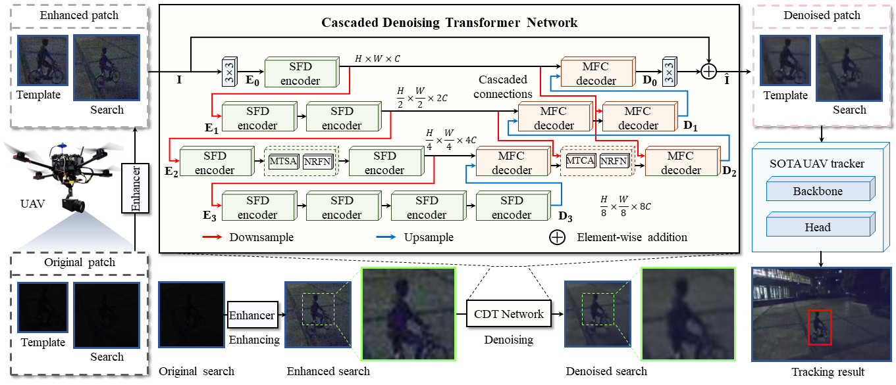

# [CDT]
# Cascaded Denoising Transformer for UAV Nighttime Tracking (RAL2023)

### Kunhan Lu, Changhong Fu, Yucheng Wang, Haobo Zuo, Guangze Zheng, and Jia Pan

This is the official code for the paper "Cascaded Denoising Transformer for UAV Nighttime Tracking".

Kunhan Lu, Changhong Fu, Yucheng Wang, Haobo Zuo, Guangze Zheng, and Jia Pan, "Cascaded Denoising Transformer for UAV Nighttime Tracking," IEEE Robotics and Automation Letters, pp. 1-8, 2023.

\[[paper]()\]



# Abstract

The automation of unmanned aerial vehicles (UAVs) has been greatly promoted by visual object tracking methods with onboard cameras.
However, the random and complicated real noise produced by the cameras seriously hinders the performance of state-of-the-art (SOTA) UAV trackers, especially in low-illumination environments.
To address this issue, this work proposes an efficient plug-and-play cascaded denoising Transformer (CDT) to suppress cluttered and complex real noise, thereby boosting UAV tracking performance.
Specifically, the novel U-shaped cascaded denoising network is designed with a streamlined structure for efficient computation.
Additionally, shallow feature deepening (SFD) encoder and multi-feature collaboration (MFC) decoder are constructed based on multi-head transposed self-attention (MTSA) and multi-head transposed cross-attention (MTCA), respectively.
A nested residual feed-forward network (NRFN) is developed to focus more on high-frequency information represented by noise.
Extensive evaluation and test experiments demonstrate that the proposed CDT has a remarkable denoising effect and improves UAV nighttime tracking performance.
The source code, pre-trained models, and experimental results are available at here.


## Environment Preparing

```
python 3.8.3
pytorch 1.11.0
```

## Demo
### Demo Video
[](https://youtu.be/5mjNtjyvZyA "CDT")

## Train

Before training, you need to prepare the training set of the [SIDD](https://www.eecs.yorku.ca/~kamel/sidd/index.php) dataset. Run train.py.

```
python -m torch.distributed.launch --nproc_per_node=4 --master_port=12345 train.py -opt Denoising/Options/RealDenoising_CDT.yml --launcher pytorch
```


## Test

Download our pretrained model by [CDT](https://pan.baidu.com/s/1mgQI_wzjod9ElYklbxYwBQ?pwd=cdtn)(code:cdtn).

To evaluate the ability of CDT to overcome noise to improve UAV night tracking performance, you need to meet the enviroment requirements of base trackers and enhancers, as well as download their snapshots to corresponding folders at first. Details can be found in their repos. Currently supporting trackers including [SiamAPN](https://github.com/vision4robotics/SiamAPN), [SiamAPN++](https://github.com/vision4robotics/SiamAPN), [SiamRPN++](), [SiamBAN](https://github.com/hqucv/siamban), and [SiamGAT](https://github.com/ohhhyeahhh/SiamGAT), enhancers including [SCT](https://github.com/vision4robotics/SCT) and [DCE++](https://github.com/Li-Chongyi/Zero-DCE_extension).

Take the test of SiamAPN_SCT_CDT as an example:

```
python test.py                      \
  --dataset UAVDark135                            \ # dataset_name
  --datasetpath ./test_dataset                    \ # dataset_path
  --config ./experiments/SiamAPN/config.yaml      \ # tracker_config
  --snapshot ./experiments/SiamAPN/model.pth      \ # tracker_model
  --trackername SiamAPN                           \ # tracker_name

  --e_weights ./experiments/SCT/model.pth         \ # enhancer_model
  --enhancername SCT                              \ # enhancer_name

  --d_weights ./experiments/CDT/model.pth         \ # denoiser_model
  --denoisername CDT                                # denoiser_name

```

## Evaluation 

If you want to evaluate the trackers mentioned above, please put those results into `results` directory as `results/<dataset_name>/<tracker_name>`.

```
python tools/eval.py                              \
  --dataset UAVDark135                            \ # dataset_name
  --datasetpath path/of/your/dataset              \ # dataset_path
  --tracker_path ./results                        \ # result_path
  --tracker_prefix 'SiamAPN_SCT_CDT'                # tracker_name
```

## References

```
@article{Lu2023CascadedDT,  
        title={{Cascaded Denoising Transformer for UAV Nighttime Tracking}},   
        author={Lu, Kunhan and Fu, Changhong and Wang, Yucheng and Zuo, Haobo and Zheng, Guangze and Pan, Jia},  
        journal={IEEE Robotics and Automation Letters},  
        year={2023},  
        pages={1-8}  
}

@article{Fu2022SiameseOT,  
        title={{Siamese Object Tracking for Unmanned Aerial Vehicle: A Review and Comprehensive Analysis}},   
        author={Fu, Changhong and Lu, Kunhan and Zheng, Guangze and Ye, Junjie and Cao, Ziang and Li, Bowen and Lu, Geng},  
        journal={arXiv preprint arXiv:2205.04281},  
        year={2022},  
        pages={1-33}  
}
```

## Contact

If you have any questions, please contact me.

Kunhan Lu

Email: lukunhan@tongji.edu.cn .

## Acknowledgements
- The code is implemented based on [SNOT](https://github.com/vision4robotics/SiameseTracking4UAV), [BasicSR](https://github.com/XPixelGroup/BasicSR), and [Restormer](https://github.com/swz30/Restormer). We would like to express our sincere thanks to the contributors.

- We would also like to thank [SiamAPN](https://github.com/vision4robotics/SiamAPN), [SiamAPN++](https://github.com/vision4robotics/SiamAPN), [SiamRPN++](), [SiamBAN](https://github.com/hqucv/siamban), and [SiamGAT](https://github.com/ohhhyeahhh/SiamGAT) trackers and [SCT](https://github.com/vision4robotics/SCT) and [DCE++](https://github.com/Li-Chongyi/Zero-DCE_extension) enhancers for their efforts.
